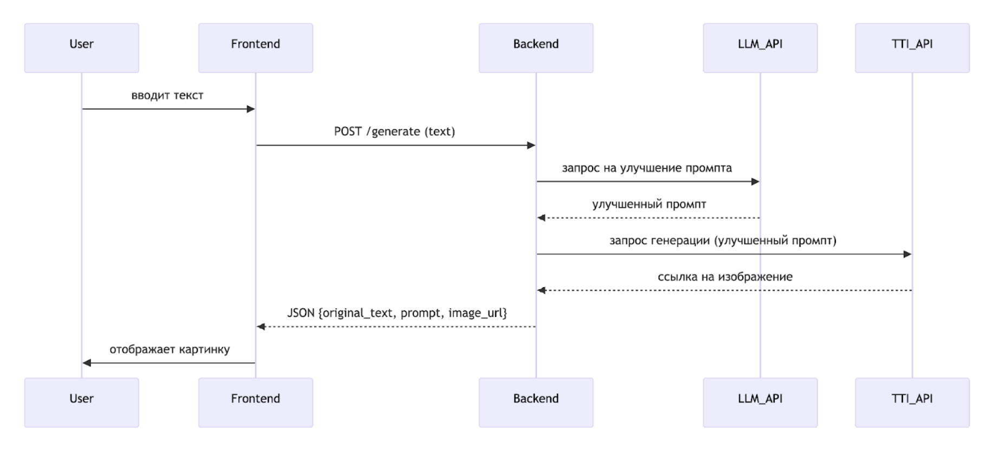

### 1. Базовый функционал (что умеет MVP)

* Пользователь вводит текстовое описание желаемого интерьера на естественном языке (например, «светлая кухня в стиле прованс с деревянной мебелью»).
* Система с помощью LLM преобразует этот запрос в детализированный промпт на английском, оптимизированный для моделей генерации изображений (добавляет уточнения про освещение, текстуры, ракурс, качество).
* Улучшенный промпт отправляется в Text-to-Image API, которое возвращает сгенерированное изображение.
* Изображение отображается пользователю в интерфейсе вместе с исходным запросом (опционально — показываем и улучшенный промпт для прозрачности).

### 2. Архитектура решения

Система состоит из трёх основных компонентов:

* Фронтенд — простая веб-страница (HTML/CSS/JS), которая принимает текст и показывает картинку.
* Бэкенд — сервер на Python, который принимает запросы от фронтенда, последовательно вызывает два API и возвращает результат.
* Внешние API:
  * LLM API (например, Yandex GPT, GigaChat) — для улучшения промпта пользователя.
  * Text-to-Image API (например, Kandinsky 3.0, Replicate SDXL) — для генерации изображения на основе улучшенного промпта.

### Пример потока работы (User Flow)

1. Пользователь открывает веб-страницу с полем ввода и кнопкой «Сгенерировать».
2. Вводит: «Спальня в скандинавском стиле, большая кровать, панорамное окно, уютно».
3. Нажимает кнопку.
4. Бэкенд отправляет этот текст в LLM с промптом:
   «Преобразуй описание интерьера в детальный промпт для генерации изображения на английском. Добавь детали: освещение, материалы, атмосферу, качество (8k, photorealistic).»
5. LLM возвращает: *"A bright Scandinavian-style bedroom with a large cozy bed, a panoramic window overlooking greenery, soft natural light, wooden floors, white walls, minimalist decor, hygge atmosphere, ultra realistic, 8k."*
6. Бэкенд отправляет этот промпт в Kandinsky API.
7. Kandinsky генерирует изображение и возвращает ссылку.
8. Бэкенд отдаёт фронтенду JSON:
   { "original": "Спальня в скандинавском стиле...", "enhanced_prompt": "A bright Scandinavian...", "image_url": "https://..." }
9. Фронтенд показывает картинку и, возможно, оба текста.
