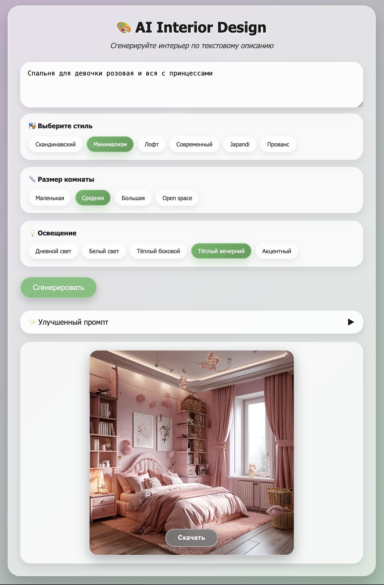

# AI Interior design[#](#ai-interior-design "Copy link")

Сервис генерации интерьерных концепций по текстовому описанию с использованием LLM и Text-to-Image моделей

## Ссылка на приложение: [https://testrepointerior-production.up.railway.app](https://testrepointerior-production.up.railway.app)

## Команда[#](#команда "Copy link")

- Вакулич Анастасия
- Рощина Надежда
- Сабуров Никита
- Сюзев Матвей
- Попов Иван
- Фиданян Денис

## Описание проекта[#](#описание-проекта "Copy link")

AI-сервис генерации интерьерных концепций, который помогает пользователю быстро сформировать визуальное и структурированное представление будущего пространства на основе текстового описания или базовых параметров помещения. Сервис объединяет возможности генеративных моделей изображений для визуализации дизайна и больших языковых моделей для рекомендации конкретных товаров

Платформа использует технологии машинного обучения, чтобы:

- Преобразовывать неструктурированное описание «вайба» в профессиональный дизайн-бриф
- Генерировать визуализации интерьера в заданном стиле
- Предлагать альтернативные стилевые решения для одного и того же пространства
- Подбирать примерные категории мебели и декора под выбранную концепцию
- Снижать барьер входа к профессиональному интерьерному проектированию

## Структура репозитория

- templates/index.md, templates/index_v2.md - верстка веб-приложения (первая версия и версия с улучшениями)
- main.py - исполняемый код приложения
- yandex_utils.py, gigachat_utils.py - вспомогательные функции для взаимодействия с моделями по API

- README.md - общее описание проекта
- ANALYSIS.md - анализ ЦА
- DESCRIPTION_v1.md - описание первой версии проекта
- TESTS.md - результаты тестирования на небольшой фокус-группе
- IMPROVEMENTS.md - описание внедренных улучшений